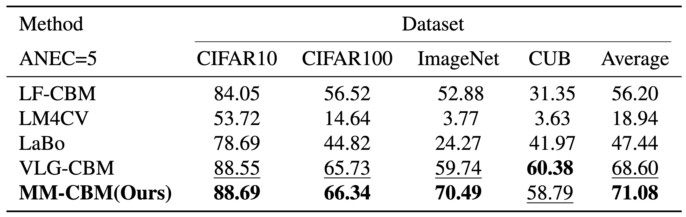
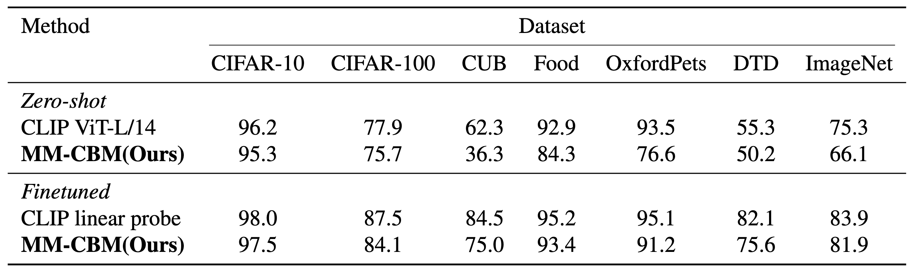
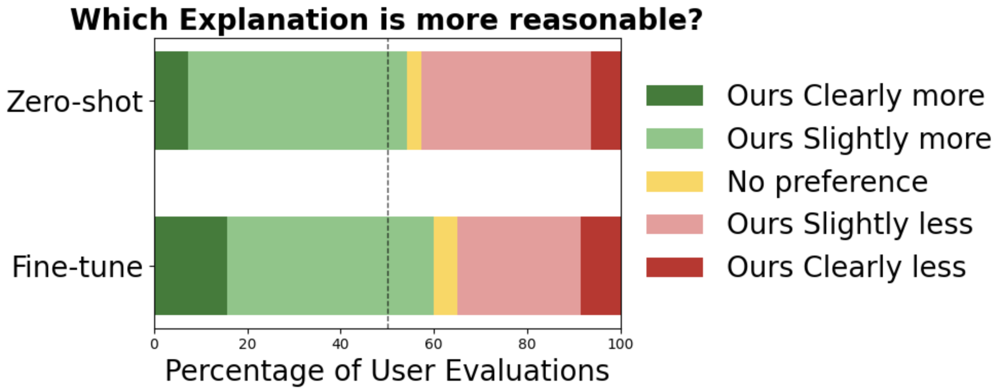

# Multimodal Concept Bottleneck Models

* This is our official repo of **[Multi-Modal Concept Bottleneck Models (MM-CBMs)](https://openreview.net/pdf?id=6r2ercqOo8)** at Mechanistic Interpretability Workshop at NeurIPS 2025. MM-CBM is a new framework to transform multi-modal models such as CLIP into fully interpretable models with human-friendly concepts while preserving zero-shot ability. 
* Please see our [Project Page](https://lilywenglab.github.io/Multi-Modal-CBM/) for a quick overview of our work.

<p align="center">
  
</p>

## Setup

1. Install Python (3.10) and PyTorch (1.13).
2. Install dependencies by running `pip install -r requirements.txt`
3. Download and process CUB dataset by running `bash download_cub.sh` 
4. Download and process ImageNet dataset by running `bash download_imagenet.sh` (Replace the download link)

## Evaluate pretrained models

Run `MMCBM_evaluation_finetuned.ipynb` and `MMCBM_evaluation_zero-shot.ipynb` to evaluate the pretrained models. Provides both overall accuracy and per-class accuracy. Generates multimodal explanations in textual form for the model’s predictions. Weights can be downloaded from https://drive.google.com/file/d/1myxyqthTE1L4YgEZzjMRabbWjo9sokCQ/view?usp=sharing.

## Train your own model (Optional)
1. Extract candidate concepts with GPT and clean concept set: `GPT_initial_concepts.ipynb`, `GPT_conceptset_processor.ipynb` (This step will incur expenses.)
2. Text augmentation with LLaMA: `label_expand.ipynb`
3. Annotate images with object detection: `python image_annotation.py --dataset {dataset_name_subset}`
4. Train the Concept Bottleneck Model (CBM): `python train_cbm.py --dataset {dataset_name} --weight 0.2`

## Overview
<p align="center">
  
</p>

## Results
### 1. Compared with other CBMs
MM-CBM achieves performance comparable to the strongest baseline, VLG-CBM, and surpasses others by over 10% accuracy on ImageNet.<br>
<p align="center">
  
</p>

### 2. Compared with black-box CLIP
Across seven datasets, MM-CBM attains performance comparable to CLIP’s linear-probe and zero-shot results.<br>
<p align="center">
  
</p>

### 3. Interpretable results
We compared two variants of MM-CBM (zero-shot and fine-tuned) against SpLiCE. For each method, participants were shown 100 randomly sampled ImageNet images with the correct label.<br>
<p align="center">
  
</p>

## Reference
1. Radford et al., [Learning transferable visual models from natural language supervision](https://arxiv.org/abs/2103.00020), ICML 2021 
2. Oikarinen et al., [Label-free Concept Bottleneck Models](https://arxiv.org/abs/2304.06129), ICLR 2023
3. Bhalla et al., [Interpreting clip with sparse linear concept embeddings (splice)](https://arxiv.org/abs/2402.10376), NeurIPS 2024 
4. Srivastava et al., [VLG-CBM: Training concept bottleneck models with vision-language guidance](https://arxiv.org/abs/2408.01432), NeurIPS 2024 
5. Koh et al., [Concept bottleneck models](https://arxiv.org/abs/2007.04612), ICML 2020
6. Liu et al., [Grounding dino: Marrying dino with grounded pre-training for open-set object detection](https://arxiv.org/abs/2303.05499), ECCV 2024
7. Song et al., [Mpnet: Masked and permuted pre-training for language understanding](https://arxiv.org/abs/2004.09297), NeurIPS 2020.
8. Dubey et al., [The llama 3 herd of models](https://arxiv.org/abs/2407.21783), arXiv preprint 2024.
9. Liu et al., [Visual instruction tuning](https://arxiv.org/abs/2304.08485), NeurIPS 2023
10. Yan, et al., [Learning concise and descriptive attributes for visual recognition](https://arxiv.org/abs/2308.03685), ICCV 2023
11. Yang, et al., [Language in a bottle: Language model guided concept bottlenecks for interpretable image classification](https://arxiv.org/abs/2211.11158), CVPR 2023

## Cite this work
T. Shi, G. Yan, T. Oikarinen, and T.-W. Weng, [Multimodal concept bottleneck models](https://openreview.net/pdf?id=6r2ercqOo8), Preprint 2025.
```
@misc{shi2025multimodal,
      title={Multimodal Concept Bottleneck Models},
      author={Shi, Tongqing and Yan, Ge and Oikarinen, Tuomas and Weng, Tsui-Wei},
      booktitle={Preprint 2025}
    }
```
